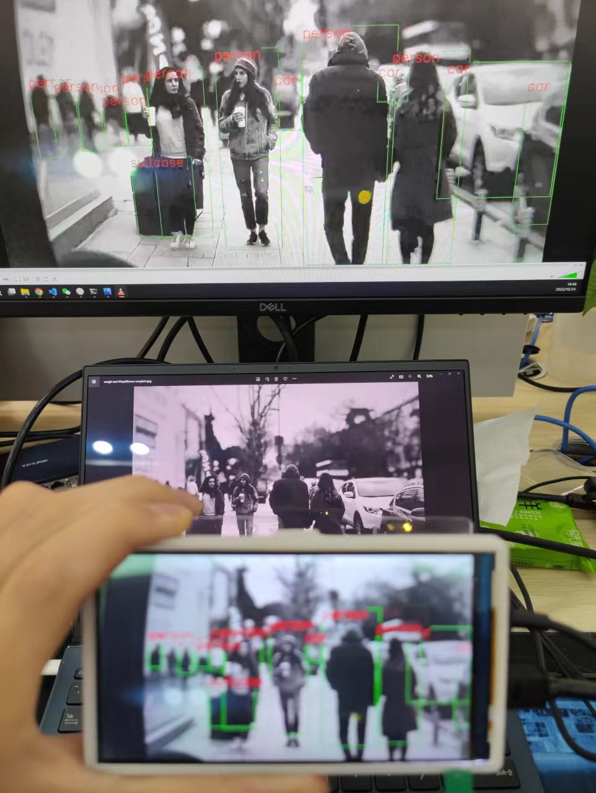

# ax-pipeline
**AX-Pipeline** 由 **[爱芯元智](https://www.axera-tech.com/)** 主导开发。该项目基于 **AXera-Pi** 展示 **ISP**、**图像处理**、**NPU**、**编码**、**显示** 等功能模块软件调用方法，方便社区开发者进行快速评估和二次开发自己的多媒体应用。

## 已支持开发板

- [AXera-Pi](https://wiki.sipeed.com/m3axpi)(AX620A)

## 快速上手

### 编译
- [快速编译](docs/compile.md)  基于 cmake 实现简单的跨平台编译。

### 示例
- [sample_vin_joint](examples/sample_vin_joint)
- [sample_vin_ivps_joint_venc_rtsp](examples/sample_vin_ivps_joint_venc_rtsp)
- [sample_vin_ivps_joint_venc_rtsp_vo](examples/sample_vin_ivps_joint_venc_rtsp_vo)

### DEMO视频（点击图片播放）

## 技术讨论
- Github issues
- QQ 群: 139953715
