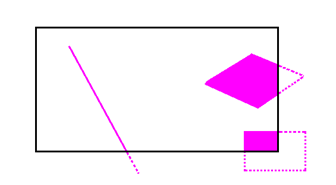

# 如何部署自己的其他模型

### 阅读文档

仔细阅读 [AXera Pulsar 工具链指导手册](https://pulsar-docs.readthedocs.io/zh_CN/latest/index.html)，学习如何将自定义的 onnx 模型，转换成 AX620 中所用的 Joint 模型。

### 插入后处理代码
  
ax-pipeline 的模型推理基本都是比较标准的操作，前处理是不需要用户在代码中配置的。

用户基本只需要关注后处理部分即可，添加所需变量到结果结构体 ```sample_run_joint_results``` ，并将结果赋值到结果结构体里。

ax-pipeline 定义了一了一个后处理的头文件 ```sample_run_joint_post_process.h``` ，位于 [examples/sample_run_joint/sample_run_joint_post_process.h](../examples/sample_run_joint/sample_run_joint_post_process.h)

```
/// @brief 模型后处理函数
/// @param nOutputSize 输出的节点数
/// @param pOutputsInfo 输出的节点对应的信息，包含维度信息、节点名称等
/// @param pOutputs 输出的节点的数据指针，包含物理地址、虚拟地址等
/// @param pResults 目标检测的结果信息
/// @param SAMPLE_ALGO_WIDTH 算法的输入宽
/// @param SAMPLE_ALGO_HEIGHT 算法的输入高
/// @param SAMPLE_MAJOR_STREAM_WIDTH 相机图像的宽
/// @param SAMPLE_MAJOR_STREAM_HEIGHT 相机图像的高
void sample_run_joint_post_process_yolov5(AX_U32 nOutputSize, AX_JOINT_IOMETA_T *pOutputsInfo, AX_JOINT_IO_BUFFER_T *pOutputs, sample_run_joint_results *pResults,
                                   int SAMPLE_ALGO_WIDTH, int SAMPLE_ALGO_HEIGHT, int SAMPLE_MAJOR_STREAM_WIDTH, int SAMPLE_MAJOR_STREAM_HEIGHT);
```

用户可以在这里定义自己的后处理的函数，完成自己的模型的后处理，后处理函数调用主要在 ```pipeline_ai.c``` 中。

一些常用模型的后处理代码，可以参考 [ax-samples](https://github.com/AXERA-TECH/ax-samples)

### OSD 
ax-pipeline 使用 opencv 进行绘图，基本步骤如下
- 申请与需要 OSD 的目标图像一样大的四通道图片
- 在申请的四通道中进行绘图，不需要绘图的区域保持通道透明
- 通过 IVPS 将申请的四通道图片，覆盖到需要 OSD 的目标图像上
  
所以，用户可以自定义绘图算子，绘制任意内容到上述的四通道图像中，绘图的具体操作可参考以下代码文件：
- [examples/sample_vin_ivps_joint_venc_rtsp/pipe/pipeline_osd.c](../examples/sample_vin_ivps_joint_venc_rtsp/pipe/pipeline_osd.c) RgnThreadFunc_V2 函数
- [examples/utilities/osd_utils.cpp](../examples/utilities/osd_utils.cpp) drawObjs 函数

OSD 超出图像范围的内容会丢失，请注意绘图时 ```坐标、mask``` 是否超出了图像范围，如下图所示：

