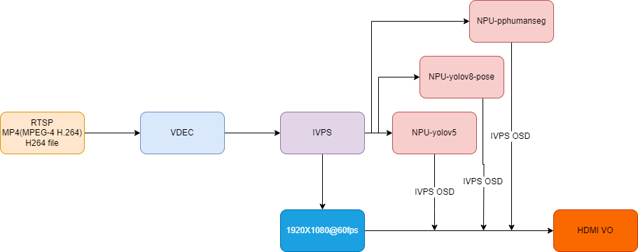

## 简介
  通过 RTSP/MP4 输入，实现算力盒子。

## 流程图


## 快速体验
1、准备想要进行推流的 h264 格式的二进制文件，或 h264 格式的 mp4 文件，下文用 test.h264

2、打开 [rtsp-simple-server](https://github.com/aler9/rtsp-simple-server/releases/tag/v0.21.0) 选择对应的平台，下载 rtsp-simple-server 可执行文件，并双击或者在命令行执行在后台

3、下载安装 ffmpeg，通过以下命令，将 test.h264 推流
```
ffmpeg -re -stream_loop -1 -i test.h264 -rtsp_transport tcp -c copy -f rtsp rtsp://localhost:8554/test
```

4、假设我们已知 rtsp-simple-server 运行的宿主机的 ip 为 192.168.31.1，并已知爱芯派也在宿主机同一局域网中

5、运行以下命令，进行 rtsp 的取流、解码、推理的 pipeline
```
./sample_demux_ivps_joint_hdmi_vo -f rtsp://192.168.31.1:8554/test -p config/yolov5s.json
```

6、运行以下命令，循环进行 mp4/h264 文件的解包、解码、推理的 pipeline
```
./sample_demux_ivps_joint_hdmi_vo -l 1 -f test.h264 -p config/yolov5s.json
```

7、运行以下命令，进行 mp4/h264 文件的解包、解码、推理的 pipeline，同时推几种不一样的模型，并在 HDMI 屏幕上进行分块显示
```
./sample_demux_ivps_joint_hdmi_vo -l 1 -f test.h264 -p config/yolov5s.json -p config/yolov8_pose.json -p config/yolox.json
```