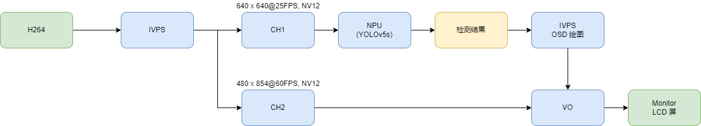

## 简介
  通过h264格式的MP4文件输入，实现算力盒子。

## 流程图


## 快速体验
```bash
Usage:./sample_mp4_ivps_joint_vo -h for help

        -p: model config file path
        -f: mp4 file(just only support h264 format)
        -l: loop play video(循环播放)
```

```
./sample_mp4_ivps_joint_vo -f xxx.mp4 -l 1 -p config/yolov5s.json
```
