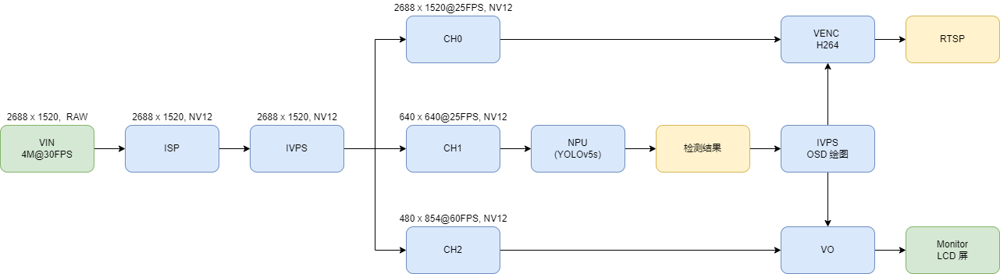

## 简介
  主要展示了如何 VIN 取图，然后经过 IVPS 输出三路流以供不同任务使用，最后达到同时进行 NPU-Yolov5s 检测、RTSP 输出、VO 屏幕显示的效果。

## 流程图


## 快速体验
```
# wget https://github.com/AXERA-TECH/ax-models/blob/main/ax620/yolov5s_sub_nv12_11.joint
# export LD_LIBRARY_PATH=$LD_LIBRARY_PATH:./
# ./sample_vin_ivps_joint_venc_rtsp_vo -m ./yolov5s_sub_nv12_11.joint -c 0
```