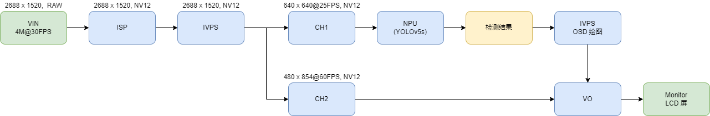

## 简介
  主要展示了如何 VIN 取图，然后经过 IVPS 输出两路流以供不同任务使用，最后达到同时进行 NPU-Yolov5s 检测、VO 屏幕显示的效果。

## 流程图


## 快速体验
1、浏览 [ModelZoo](../../docs/modelzoo.md)，下载想要体验的模型，下面以 yolov5s 为例
```
wget https://github.com/AXERA-TECH/ax-models/raw/main/ax620/yolov5s.joint
```
2、确认对应模型的 config 文件中，模型路径是正确的
```
{
    "MODEL_TYPE": "MT_DET_YOLOV5",
    "MODEL_PATH": "./models/yolov5s.joint",
    "ANCHORS": [
      ...
      ...
```
3、运行 sample（```-p```指定 config 文件， ```-c``` 参数指的是 sensor 索引，通过 ```-h``` 查看支持的sensor）
```
./sample_vin_ivps_joint_vo -p config/yolov5s.json -c 0
```