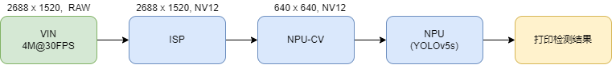

## 简介
  主要展示了如何 VIN 取图，然后通过 ISP 获得 NV12 的图像，进行 NPU-Yolov5s 检测。

## 流程图


## 快速体验
注意：如果用户希望体验人脸检测功能，请将以下步骤中的：
- ```yolov5s_sub_nv12_11``` 替换成 ```yolov5s_face_nv12_11```
- ```yolov5s.json``` 替换成 ```yolov5s_face.json```

1、下载 yolov5s 的 joint 模型文件，并确保 sha1 校验 ok（如果不想跑模型，或已经下载并确认模型没问题，本步骤可跳过。如不希望跑模型，运行时不要设置 ```-m``` 参数即可）
```
# wget https://github.com/AXERA-TECH/ax-models/raw/main/ax620/yolov5s_sub_nv12_11.joint
# sha1sum -c config/yolov5s_sub_nv12_11.sha1sum
yolov5s_sub_nv12_11.joint: OK
```
2、运行 sample（ ```-c``` 参数指的是 sensor 索引，通过 ```-h``` 查看支持的sensor）
```
# ./sample_vin_joint -m ./yolov5s_sub_nv12_11.joint -p config/yolov5s.json -c 0
```